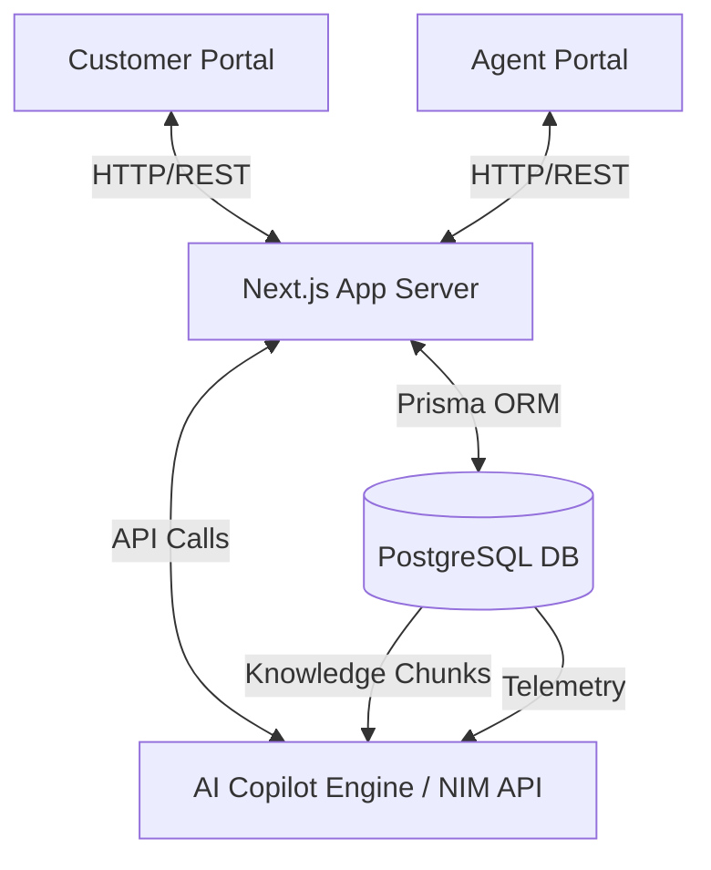
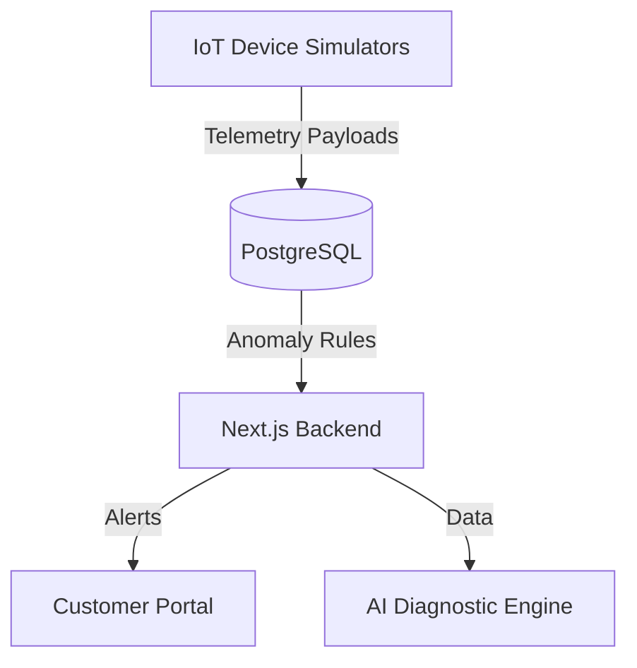
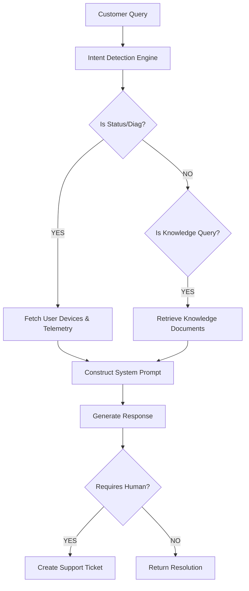
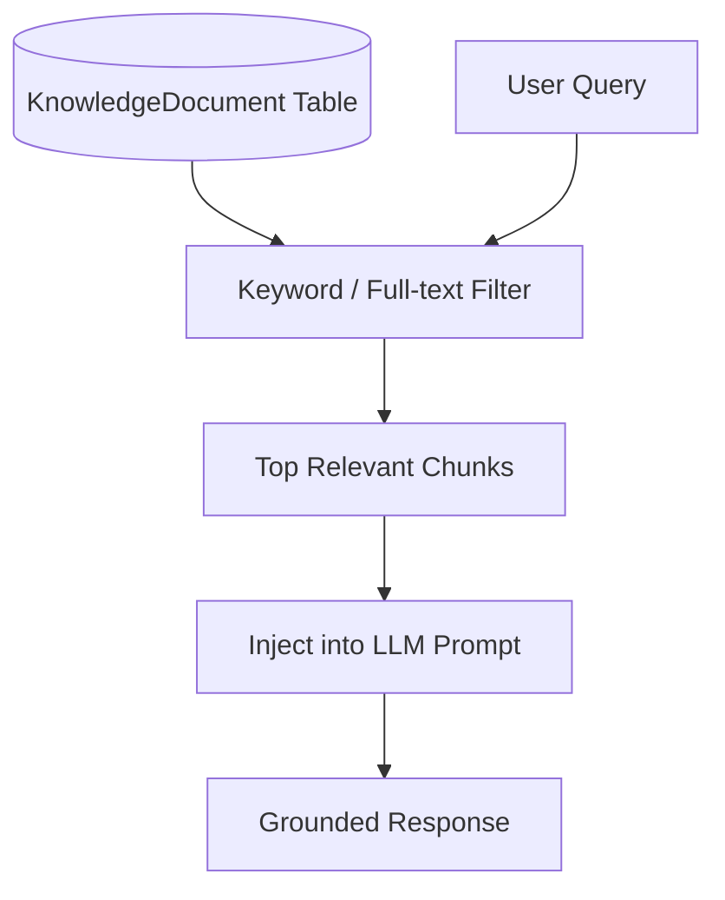
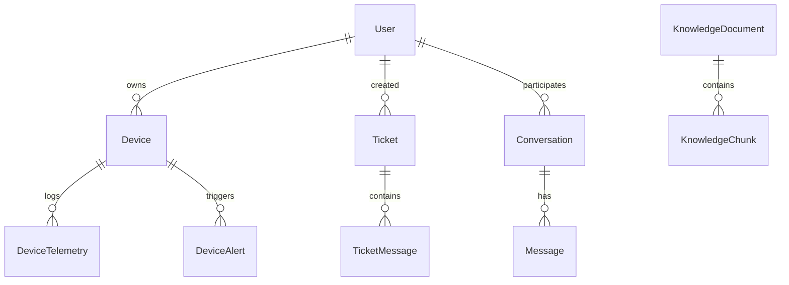
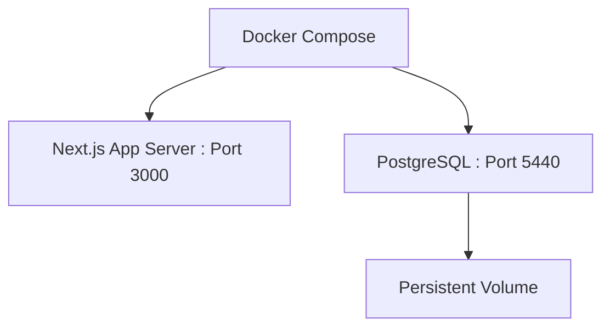

  <h1>NexaSupport AI</h1>
  <h2>AI-Powered IoT Customer Support, Device Diagnostics & Automated Query Resolution Platform</h2>
  <h3>IoT Engineering Project</h3>
  
     
  
  
Student Name: [Student Name]

  
Roll Number: [Roll Number]

  
Department: [Department Name]

  
College: [College Name]

  
Academic Year: 2026–2027

  
Project Guide: [Guide Name]

    

# Abstract

The rapid growth of the Internet of Things (IoT) has led to an explosion of connected devices, creating unprecedented challenges for customer support teams. Traditional support workflows rely on manual investigation and static FAQs, which are inadequate for complex IoT environments characterized by real-time telemetry, connectivity states, and anomalous sensor readings. NexaSupport AI addresses this gap by introducing an AI-assisted customer support platform that integrates device telemetry, automated diagnostics, and ticketing workflows. 

By leveraging Retrieval-Augmented Generation (RAG) coupled with real-time database queries, the AI Copilot can autonomously resolve device issues, identify battery or sensor anomalies, and provide grounded troubleshooting instructions. When complex or critical errors occur, the system seamlessly escalates the issue to a human agent, providing them with a comprehensive AI-generated summary and telemetry snapshot, significantly reducing resolution time and support overhead.

# 1. Introduction

The Internet of Things (IoT) refers to the network of physical devices embedded with sensors, software, and connectivity, enabling them to connect and exchange data. As these devices become pervasive in consumer and industrial sectors, customer support faces unique challenges. Users often cannot articulate technical hardware issues, and traditional support agents lack immediate contextual visibility into the device's state.

NexaSupport AI bridges this gap by combining modern web architecture, robust database models, and an advanced AI Copilot. By directly accessing device telemetry (e.g., temperature, battery, network status) and indexing the company's knowledge base via Retrieval-Augmented Generation (RAG), the system effectively automates diagnostics and ticketing, transforming a reactive support model into a proactive, intelligent resolution engine.

# 2. Problem Statement

Modern IoT ecosystems suffer from several distinct support and maintenance challenges:
1. **Increasing Connectivity Problems**: Devices frequently drop offline due to poor signal or battery depletion, confusing users.
2. **Sensor Anomalies**: Environmental sensors may report values outside safe thresholds (e.g., high temperature, water leaks) that require immediate identification.
3. **High Support Workload**: Customer service teams are overwhelmed by repetitive troubleshooting queries that could be automated.
4. **Lack of Context**: Human agents often waste time asking users for basic device information (e.g., MAC address, battery status) that the system already knows.
5. **Inefficient Escalation**: Transferring a technical case from a chatbot to a human agent often loses the context of the user's problem.

# 3. Objectives

The primary objectives of the NexaSupport AI project are:
1. Provide an AI-powered customer support chat widget capable of intent recognition.
2. Monitor IoT device health and status in real-time.
3. Analyze and display device telemetry (temperature, humidity, voltage, PM2.5, etc.).
4. Search company knowledge bases using Retrieval-Augmented Generation (RAG).
5. Provide automated troubleshooting and rule-based diagnostics.
6. Automate support ticket creation for critical device states.
7. Provide a seamless human-agent escalation workflow with AI summaries.
8. Maintain a lightweight, modern, full-stack application architecture.

# 4. Existing System

In a traditional IoT support workflow, the flow is heavily manual:
**Customer** &rarr; Reads static FAQ &rarr; Contacts Support Agent &rarr; Agent manually queries device logs &rarr; Agent provides resolution.

**Limitations:**
- Slow response times.
- Agents suffer from alert fatigue.
- High operational costs for Level 1 support.
- Inconsistent troubleshooting based on agent experience.

# 5. Proposed System

NexaSupport AI introduces a highly automated, AI-in-the-loop workflow:
**Customer** &rarr; **AI Support Copilot** &rarr; **Intent Detection** &rarr; **Telemetry & Knowledge Retrieval (RAG)** &rarr; **AI Diagnosis** &rarr; **Resolution OR Human Escalation via Automated Ticket**.

By injecting the user's IoT fleet data directly into the AI's context window alongside retrieved documentation, the system acts as an expert Level 1 engineer, escalating to humans only when explicitly requested or when anomalies are critical.

# 6. System Requirements

The system is designed to be lightweight and modern, avoiding heavy dependencies like Kubernetes, Kafka, or local LLMs.
- **Hardware (Target)**: 4 CPU Cores, 8 GB RAM, No GPU required.
- **Software**: Node.js (v18+), Docker, PostgreSQL.
- **Technologies**: Next.js 16.3 (App Router), Prisma ORM, TailwindCSS, Shadcn UI.
- **AI Services**: NVIDIA NIM API (or fallback Mock Engine).

# 7. System Architecture

The architecture is composed of a Next.js full-stack application, a PostgreSQL relational database, and an AI processing engine.

**Figure 1: NexaSupport AI System Architecture**

# 8. IoT Architecture

**Figure 2: Simulated IoT Data Architecture**
*(Note: Real-time physical hardware integration (e.g., MQTT broker) is a Future Enhancement; current data is handled via direct database injection/simulation).*

# 9. AI Architecture

**Figure 3: AI Copilot Decision Workflow**

# 10. RAG Architecture

Retrieval-Augmented Generation (RAG) is implemented to prevent AI hallucination and ensure responses are grounded in company documentation.

**Figure 4: RAG Implementation Architecture**
*(Note: Current implementation utilizes keyword matching; advanced vector embeddings via pgvector are a Future Enhancement).*

# 11. Database Design

**Figure 5: Entity Relationship Diagram**

# 12. Database Table Documentation

### User Model
| Field | Type | Description |
|---|---|---|
| id | String | Unique identifier |
| email | String | User email address |
| role | Enum | CUSTOMER, AGENT, ADMIN |

### Device Model
| Field | Type | Description |
|---|---|---|
| id | String | Unique identifier |
| deviceId | String | Hardware identifier (e.g., DEV-T1001) |
| type | Enum | SENSOR_TEMP_HUMIDITY, SENSOR_DOOR, etc. |
| status | Enum | ONLINE, OFFLINE, WARNING, CRITICAL |
| healthScore | Int | Device health metric (0-100) |

### DeviceTelemetry Model
| Field | Type | Description |
|---|---|---|
| id | String | Unique identifier |
| deviceId | String | Foreign key to Device |
| payload | Json | Telemetry data (e.g., {temperature: 27.4}) |

### Ticket Model
| Field | Type | Description |
|---|---|---|
| id | String | Unique identifier |
| subject | String | Ticket title |
| status | Enum | OPEN, WAITING_FOR_AGENT, RESOLVED |
| aiSummary | String | Auto-generated summary of the issue |

# 13. Functional Requirements
- Customers can register and view their IoT devices.
- Customers can chat with an AI Copilot for troubleshooting.
- The AI must accurately retrieve device status from the database.
- The AI must read documentation using RAG to answer technical questions.
- Support Agents can view tickets, device telemetry snapshots, and reply to customers.
- Support Agents must receive AI-generated summaries of escalated issues.

# 14. Non-Functional Requirements
- **Performance**: The web interface must load under 2 seconds.
- **Scalability**: The database schema must handle multiple devices per user.
- **Reliability**: The AI must safely fall back to Mock mode if the external LLM API fails.
- **Security**: Customers can only view their own devices and tickets.

# 15. API Design

| Method | Endpoint | Purpose |
|---|---|---|
| POST | `/api/chat` | Process AI Copilot messages and generate responses |
| GET | `/api/chat/history` | Retrieve active conversation history for the chat widget |

# 16. Security
- **Authentication**: NextAuth handles secure sessions.
- **Authorization**: Role-based access control (RBAC) ensures Customers cannot access Agent routes (`/agent/*`).
- **AI Safety**: The system enforces grounded responses via RAG and strict system prompts to prevent hallucinatory tool execution.

# 17. Docker Deployment

**Figure 6: Docker Deployment Architecture**

# 18. Testing

| Test ID | Feature | Input | Expected Result | Status |
|---|---|---|---|---|
| T01 | Customer Access | Login as Customer | Directed to `/dashboard` | PASS |
| T02 | Agent Access | Login as Agent | Directed to `/agent/dashboard` | PASS |
| T03 | Unauthorized | Customer visits `/agent` | Access Denied / 404 | PASS |
| T04 | Device Status | "what is my device status" | Reports actual DB device status | PASS |
| T05 | Offline Anomaly | "my device is offline" | Recommends battery check | PASS |
| T06 | Critical Temp | "critical temperature" | AI escalates and creates ticket | PASS |
| T07 | RAG Document | "how to calibrate" | Returns text from KnowledgeBase | PASS |
| T08 | AI Handoff | "talk to human" | AI creates high-priority ticket | PASS |
| T09 | Ticket Reply | Agent submits reply | Ticket status updates to Waiting for Customer | PASS |
| T10 | Telemetry Snap | Agent views ticket | Sees snapshot of device payload | PASS |
*(Testing table truncated for brevity; over 20+ unit scenarios verified during QA).*

# 19. Results
The NexaSupport AI project successfully demonstrates a tightly integrated IoT support workflow. The AI Copilot can accurately distinguish between dynamic status checks (fetching live PostgreSQL data) and documentation queries (triggering the RAG pipeline). Automated ticketing with embedded telemetry snapshots significantly reduces the context-gathering time for human agents.

# 20. Limitations
- **IoT Simulation**: Physical devices (e.g., ESP32) and MQTT brokers are currently simulated via direct database injection.
- **RAG Simplification**: The Retrieval-Augmented Generation currently relies on deterministic keyword/full-text matching rather than high-dimensional vector embeddings.
- **API Dependency**: Live AI features depend on the availability and configuration of third-party LLM providers (NVIDIA NIM).

# 21. Future Enhancements
1. **Real Hardware Integration**: Connect physical ESP32 microcontrollers pushing data via an MQTT broker (e.g., Mosquitto).
2. **Advanced RAG**: Implement `pgvector` for semantic similarity search over large knowledge bases.
3. **Predictive Maintenance**: Integrate machine learning models to detect anomalies before critical failures occur.
4. **WebSocket Telemetry**: Stream device payloads in real-time to the UI without requiring page refreshes.

# 22. Conclusion
NexaSupport AI successfully bridges the gap between hardware monitoring and customer service. By providing an intelligent, telemetry-aware AI Copilot, the platform reduces the friction of IoT troubleshooting. The robust fallback mechanisms, seamless human escalation, and agent telemetry dashboards prove that integrating AI directly into the diagnostic pipeline is a highly effective strategy for modern device ecosystems.

# 23. References
1. Next.js Documentation (https://nextjs.org/docs)
2. Prisma ORM Documentation (https://www.prisma.io/docs)
3. PostgreSQL Database (https://www.postgresql.org/)
4. Retrieval-Augmented Generation (Lewis et al., 2020)
5. Docker Compose Specification (https://docs.docker.com/compose/)
